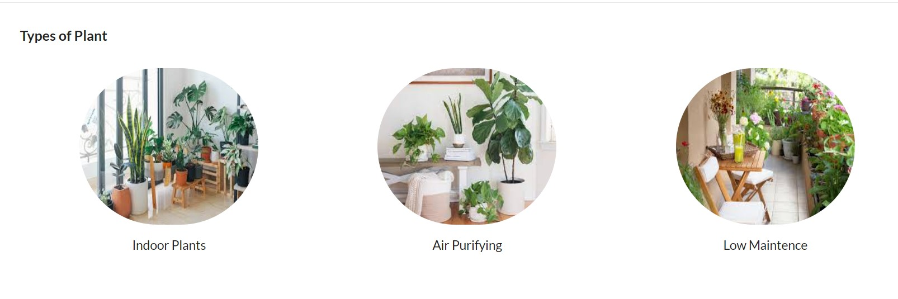
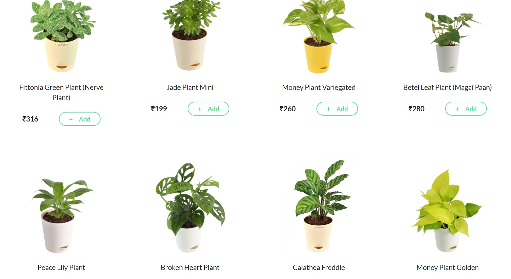
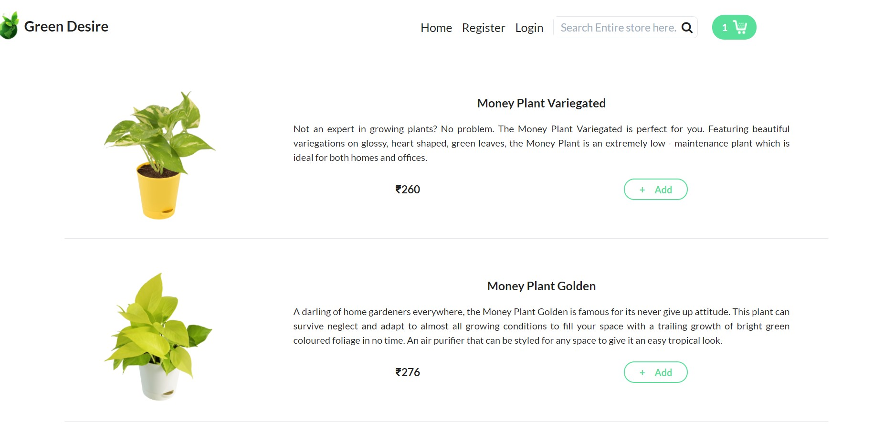
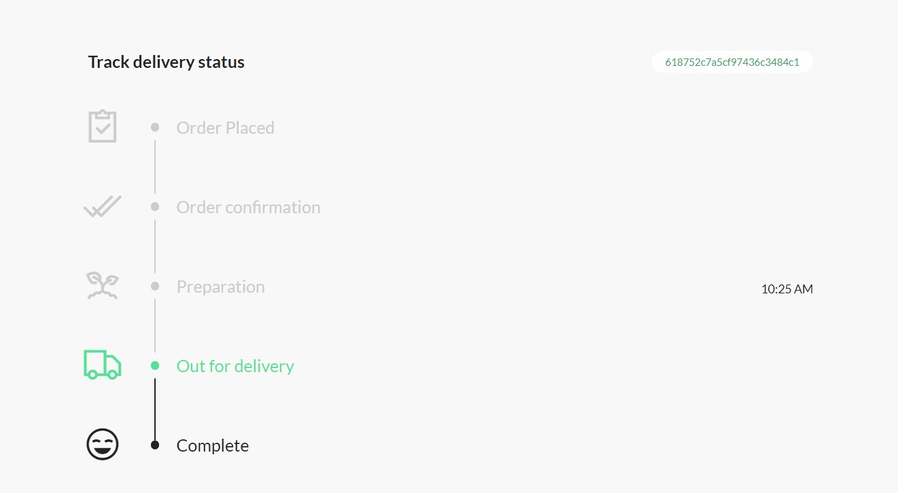

# Realtime plant selling website using Node-express-mongo-socket.io

## Installation 
After download or clone run `npm install` OR `yarn install` to install all the dependancies.

🙏 If you find this repo helpful then don't forget to give a start ❇️ to this repository. :)

# project overview: 

## functionalieties:
1) user can select a product and add to cart
2) user can pay using debit card or cash on delivery
3) user can track the order 
4) admin can mangage the order state(dispatch, out of delivery )

# project images

## register page

## login page 

## Home page 

## intro page 

## category 

## category plant page 

## all plants

## plant details page 

## search page 

## cart page 

## Payment 

## order page 

## order traking page for user

## order mangening admin panel for admin

